# HashSeq — Ideas, in Diagrams

A **Byzantine-Fault-Tolerant Sequence CRDT** for collaborative text editing in
open networks with an *unbounded, untrusted* set of collaborators.

---

## 1. The one big idea: content-addressed nodes

Every edit is a node. A node's ID is the **BLAKE3 hash of its content + its
dependencies** — *not* a Lamport clock and *not* an actor ID.

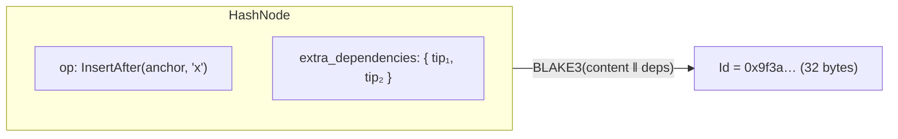

Why this matters:

| Traditional RGA / vector-clock CRDT | HashSeq |
|---|---|
| Order depends on Lamport timestamp | Order depends on a hash you can't forge |
| Per-collaborator metadata grows forever | **Zero** per-collaborator state |
| Malicious actor can lie about its clock | ID *is* the hash; lying breaks it |
| Need a permissioned actor registry | Anyone can join anonymously |

> Hash comparison **only** breaks ties between *truly concurrent* inserts that
> share the same anchor. Real ordering intent is captured by the operations
> themselves (`InsertAfter` / `InsertBefore`).

---

## 2. The four operations

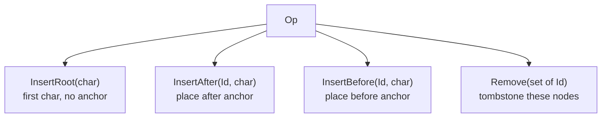

Each node also carries `extra_dependencies` — the causal context (current
**tips**) at the moment of the edit, so causality is preserved even though
there are no clocks.

---

## 3. Why `InsertBefore` exists — the interleaving problem

Say the document is `a → b` (b was typed after a) and we want to insert `x`
to get **`axb`**.

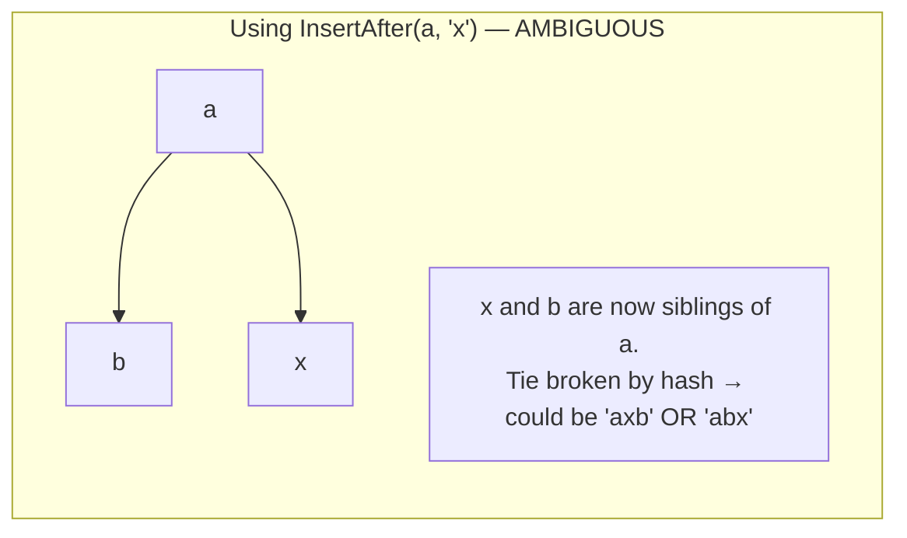

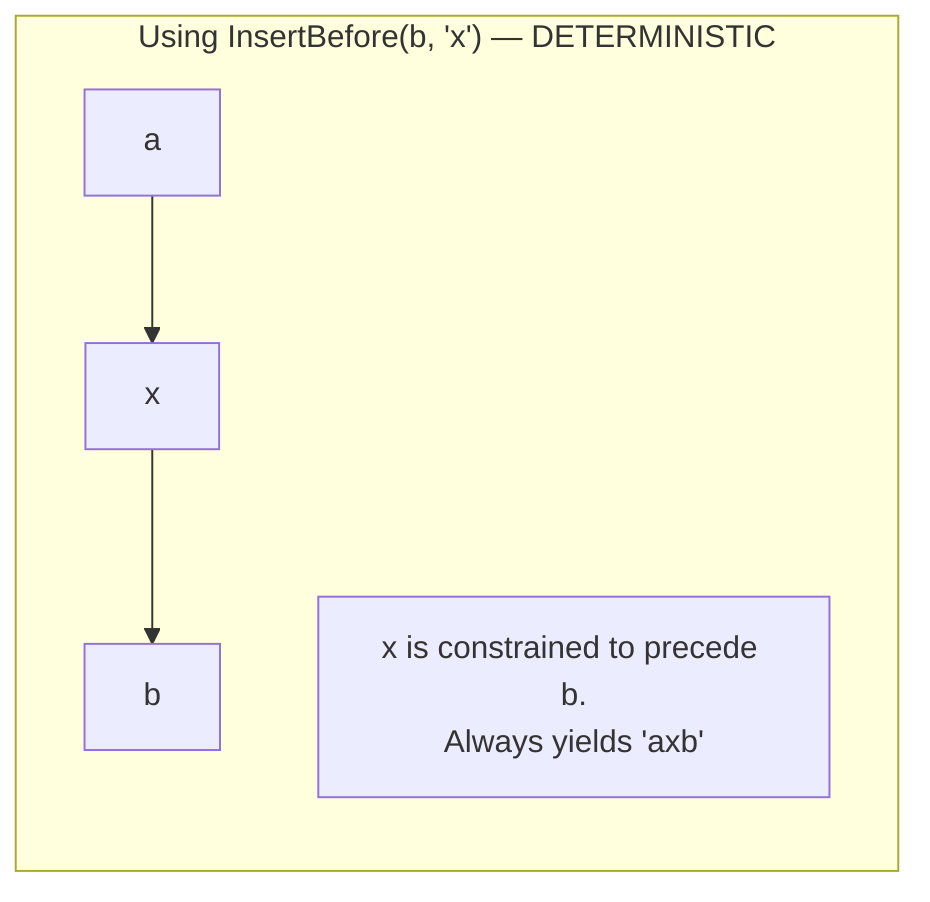

**The rule on insert** (`insert_batch`): when typing *between* a left and right
neighbour —

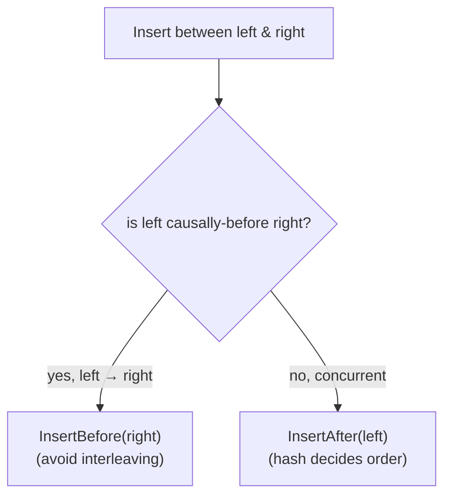

---

## 4. The causal graph & how it reads out as a sequence

Nodes form a DAG. The visible text is a **depth-first, befores-first**
traversal of that DAG.

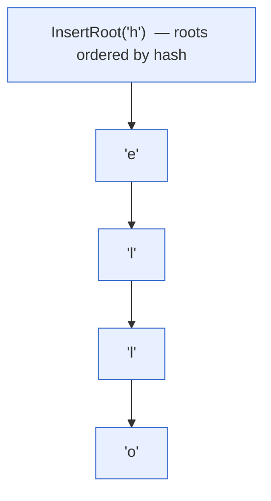

Traversal order for each node:
1. visit all **befores** (InsertBefore children) first,
2. emit the node itself,
3. then visit **afters** (InsertAfter children), sorted by hash.

Depth-first keeps concurrent runs from interleaving; hash-sorting makes the
choice deterministic across all replicas.

---

## 5. Concurrent forks resolve by hash

Two people insert different chars after the same anchor, with no knowledge of
each other:

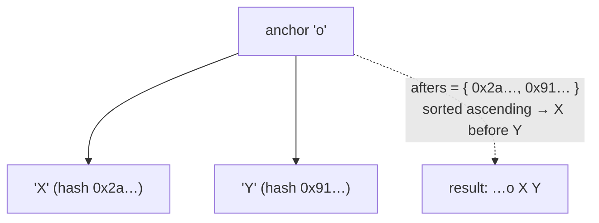

`afters: IdMap<BTreeSet<Id>>` keeps the children sorted, so every replica picks
the same branch order. Depth-first means we fully drain branch `X` before
starting branch `Y` — no `oXY` ↔ `oYX` flapping, no interleaving.

---

## 6. Runs: sequential typing is compressed

Typing "ello" one key at a time is logically four `InsertAfter` nodes chained
head-to-tail. HashSeq coalesces them into **one Run**.

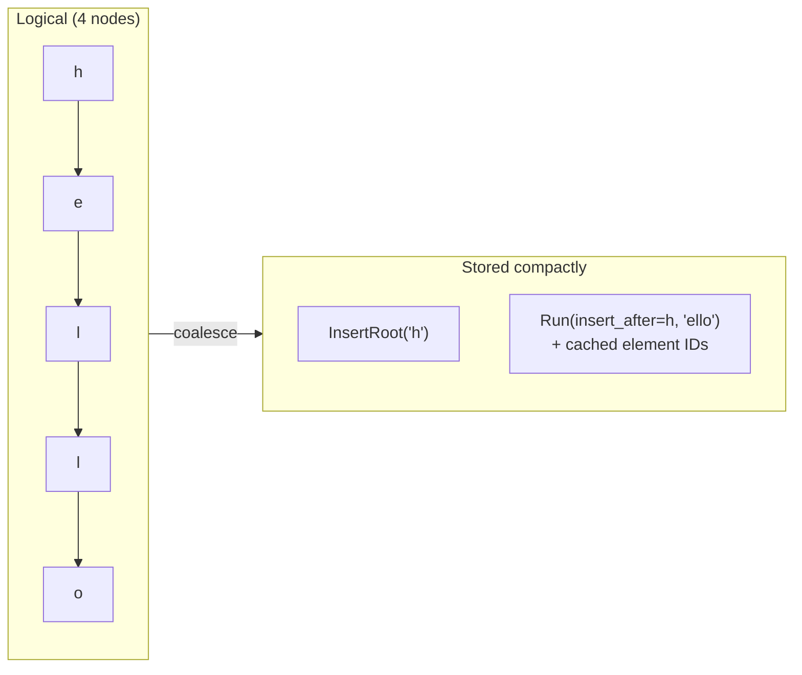

```rust
pub struct Run {
    insert_after: Id,            // anchor of the first char
    first_extra_deps: BTreeSet<Id>,
    run: String,                 // "ello"  (highly compressible)
    elements: Vec<Id>,           // cached IDs → O(1) lookup, no re-hashing
}
```

**Invariant:** a run always starts with an `InsertAfter`; never `InsertRoot`
or `InsertBefore`. An `InsertBefore` landing mid-run **splits** the run in two.

This is what gets HashSeq to >1M ops/sec — the common case (sequential typing)
is just a string append + index bump.

---

## 7. Out-of-order delivery: orphans

Operations can arrive before their dependencies (open network, no ordering
guarantees). Apply is **idempotent** and buffers what it can't place yet.

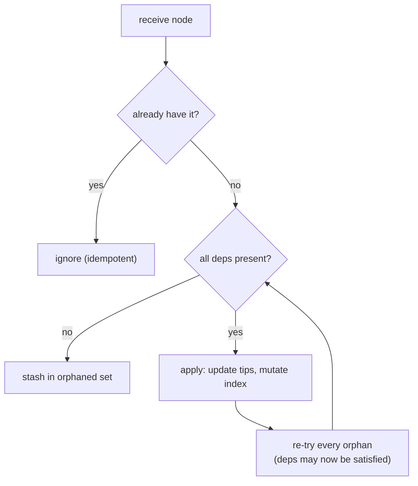

---

## 8. Tips = a lightweight vector clock

`tips` is the set of DAG "heads" (nodes nobody has built on yet). It replaces a
per-actor vector clock with a single shared set.

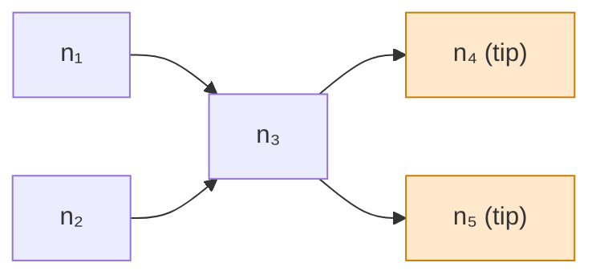

- On apply: remove the node's deps from `tips`, add the node itself.
- On a new edit: `extra_dependencies = tips − anchor`, capturing "everything I
  had seen" without naming any collaborator.

---

## 9. Merge = decompress and re-apply

There is no bespoke merge algorithm. Merging another replica just **replays its
operations**; the same idempotent/commutative apply rebuilds the structure —
runs and all.

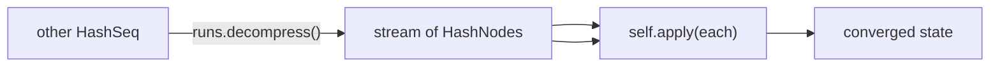

Because IDs are content hashes and apply is order-independent, this is provably
**commutative, associative, idempotent, and convergent** (verified with
QuickCheck `prop_commutative` / `prop_associative` / …).

---

## 10. The whole picture

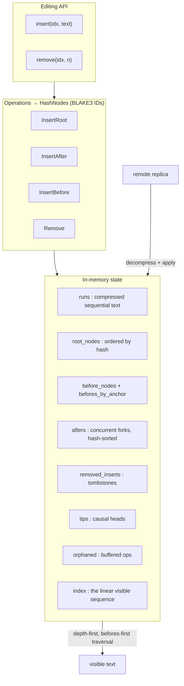

---

### TL;DR

1. **Content-addressed IDs** (BLAKE3) → BFT, no clocks, no actor metadata.
2. **InsertBefore/InsertAfter** capture ordering intent; **hash** only breaks
   ties among truly-concurrent inserts.
3. **Runs** compress sequential typing for speed and compact storage.
4. **Tips** are a clock-free causal frontier; **orphans** handle async delivery.
5. **Merge is just replay** → commutative, associative, idempotent, convergent.
